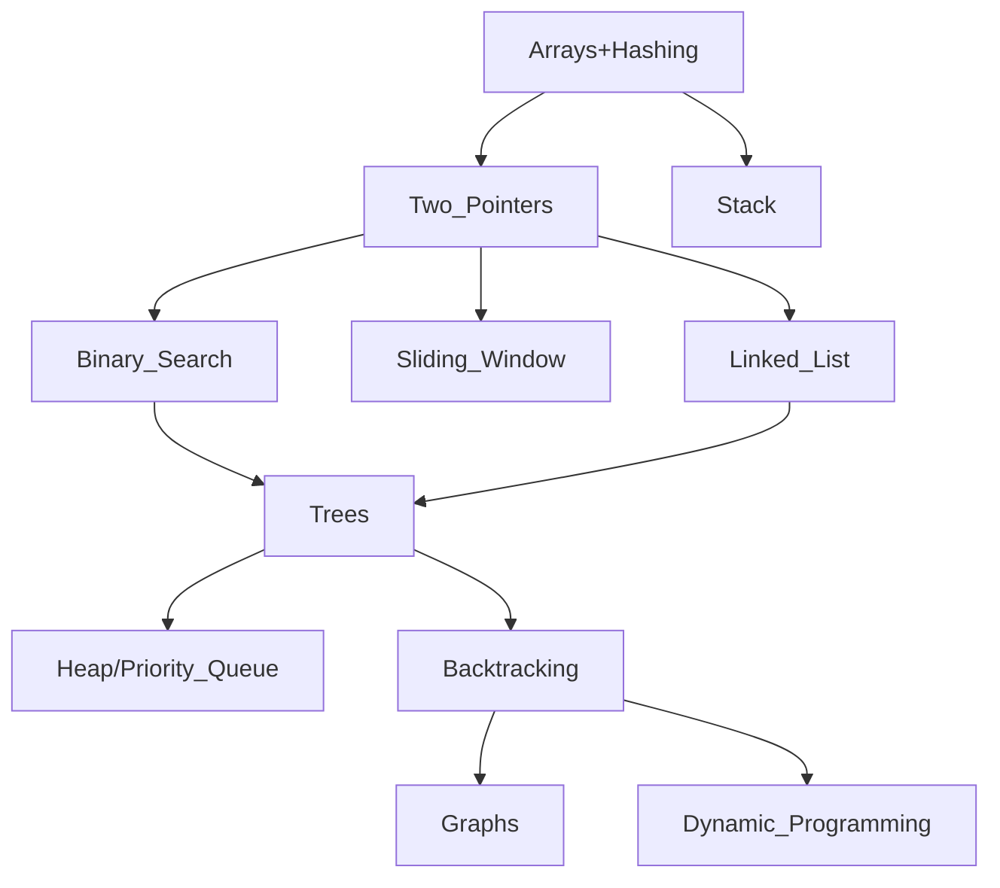

# Pre-LeetCode

This is a list of topics one should master *before* attempting to drill LeetCode problems. Trying to solve LeetCode problems without these tools is a waste of time. You will end up trying to memorize solutions rather than memorizing the tools required to derive the solutions — it is much easier to memorize the tools.

Once the tools are mastered, the solutions become more obvious, though still require practice of course.

This is the list that I used, but it is not exhaustive by any means. I consider it the bare minimum to solve LeetCode easy and medium problems confortably which will be the vast majority of code challenges in interviews.

## Containers

### Sequential

Storage of elements in a linear sequence.

- `std::vector`
- `std::list`
- `std::deque`

### Associative

Implemented with red-black trees; efficient for searching and retrieval.

- `std::set`
- `std::map`

### Unordered

Implemented as a hash table leading to average-case constant time access.

- `std::unordered_set`
- `std::unordered_map`

### Adapted

Containers for specialized functionality.

- `std::stack`
- `std::queue`
- `std::priority_queue`
- `std::string`*

\* Not technically a container, but important nonetheless.

## `TODO` Iterators

## `TODO` Algorithms and Techniques

These are the bare, essential algorithms and techniques to master.

### Sorting

- merge sort
- insertion sort
- quick sort

### Searching and Traversal

- binary search
- breadth-first search
- depth-first search
- pre-order traversal
- in-order traversal
- post-order traversal

### Techniques

- backtracking
- divide and conquer
- dynamic programming
- bit manipulation
- dijkstra's algorithm

### Roadmap

