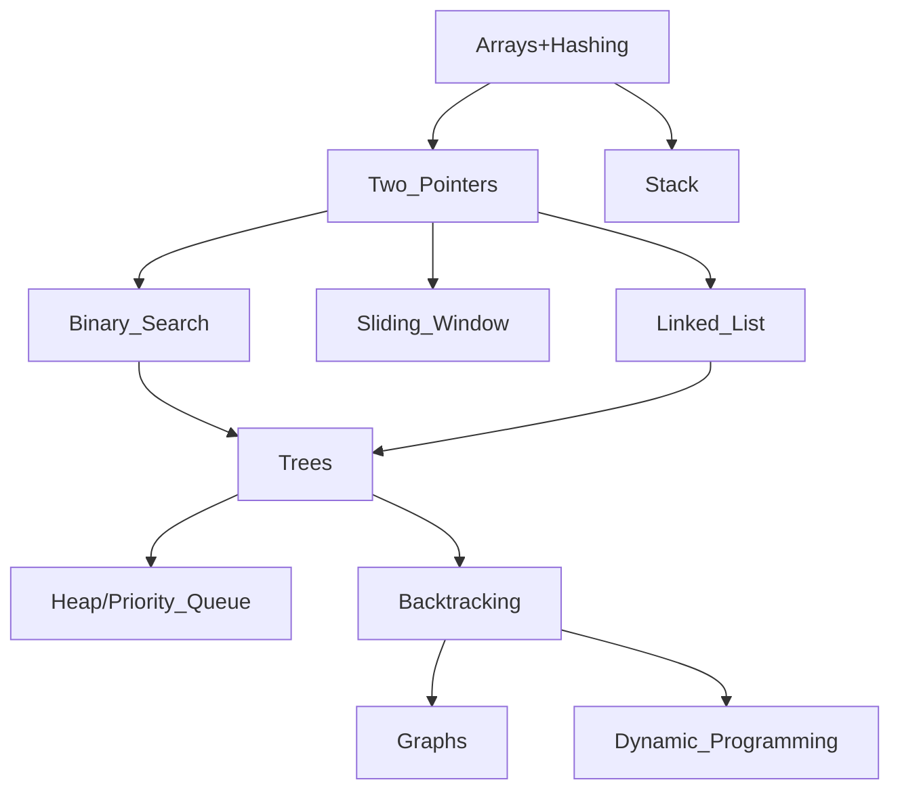

# Pre-LeetCode

This is a list of topics one should master *before* attempting to drill LeetCode problems. Trying to solve LeetCode problems without these tools is a waste of time. You will end up trying to memorize solutions rather than memorizing the tools required to derive the solutions — it is much easier to memorize the tools.

Once the tools are mastered, the solutions become more obvious, though still require practice of course.

This is the list that I used, but it is not exhaustive by any means. I consider it the bare minimum to solve LeetCode easy and medium problems confortably which will be the vast majority of code challenges in interviews.

## Sequential Containers

### std::vector

- v.push_back(e)
- v.pop_back(e)
- auto e = v.front()
- auto e = v.back()
- v.clear()
- auto e = v.at(i)

### std::list

- l.push_back(e)
- l.push_front(e)
- l.pop_back()
- l.pop_front()
- l.insert(std::const_iterator, e)
- auto e = l.front()
- auto e = l.back()

### std::deque

- d.push_back(e)
- d.pop_back()
- d.push_front(e)
- d.pop_front()
- auto e = d.front()
- auto e = d.back()
- auto e = d.at(i)

## `TODO` Associative Containers

## `TODO` Unordered Containers

## `TODO` Adapted Containers

## `TODO` Algorithms and Techniques

These are the bare, essential algorithms and techniques to master.

### Sorting

- merge sort
- insertion sort
- quick sort

### Searching and Traversal

- binary search
- breadth-first search
- depth-first search
- pre-order traversal
- in-order traversal
- post-order traversal

### Techniques

- backtracking
- divide and conquer
- dynamic programming
- bit manipulation
- dijkstra's algorithm

### Roadmap

